

  

I build **Rust systems** where reliability is the whole point: node tooling and indexers for blockchains, and CLIs that make LLM workflows reproducible. I run [Dockermint](https://dockermint.io), where I operate nodes and ship the tools we need to do it well, and I co-founded [goodcharge](https://goodcharge.app), a free, independent app that compares the real price per kWh of EV charging stations around you.

Open to **full-time roles**, **freelance missions** and **OSS collaboration**, remote or around Marseille.

 


  <a href="https://github.com/nayrosk/overbrainer"></a>
  <a href="https://github.com/Dockermint/pebblify"></a>
  <a href="https://github.com/nayrosk/evm-indexer"></a>
  <a href="https://github.com/nayrosk/Fake-Recruiter-Malware-Analysis"></a>
  <a href="https://github.com/nayrosk/nayrosk-skills-marketplace"></a>
  <a href="https://github.com/nayrosk/crazysol"></a>

 


| Project | Stars | Merged |
| :-- | :-- | :-- |
| [openclaw/openclaw](https://github.com/openclaw/openclaw) |  | [fix(ui): bypass service worker for top-level navigations](https://github.com/openclaw/openclaw/pull/87077) |
| [zeroclaw-labs/zeroclaw](https://github.com/zeroclaw-labs/zeroclaw) |  | [fix(cargo): cascade observability-prometheus to gateway crate](https://github.com/zeroclaw-labs/zeroclaw/pull/5758) |
| [patrickjaja/claude-cowork-service](https://github.com/patrickjaja/claude-cowork-service) |  | Arch Linux packaging: [#1](https://github.com/patrickjaja/claude-cowork-service/pull/1), [#4](https://github.com/patrickjaja/claude-cowork-service/pull/4), [#6](https://github.com/patrickjaja/claude-cowork-service/pull/6) |

In review: sandbox `capAdd` support in [openclaw#150307](https://github.com/openclaw/openclaw/pull/150307), low-level interaction endpoints in [camofox-browser#4210](https://github.com/jo-inc/camofox-browser/pull/4210), a distroless multi-arch image in [mx-chain-simulator-go#212](https://github.com/multiversx/mx-chain-simulator-go/pull/212).

 


  

 

  
  

  

 


  <a href="https://linktr.ee/nayrosk"></a>

